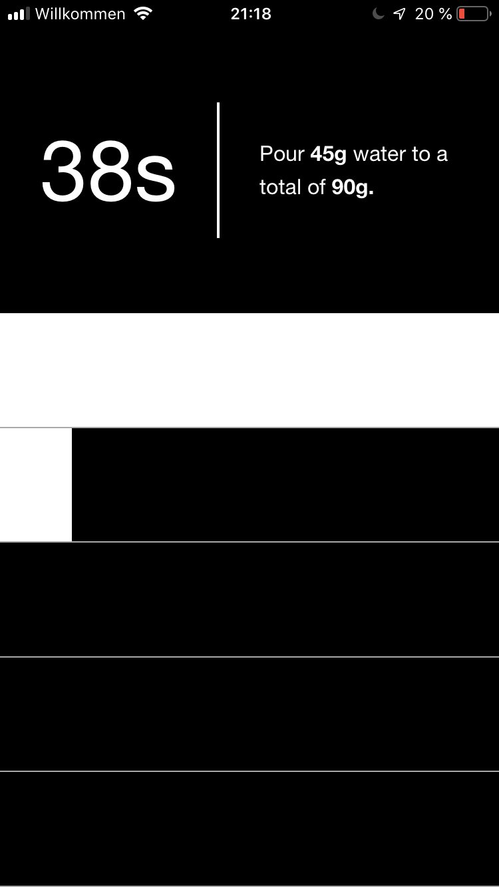

# Coffee timer

This is a coffee timer to make it easier to brew the "4:6 method" invented by Tetsu Kasuya.
A video explaining the brewing process can be found [here](https://www.youtube.com/watch?v=wmCW8xSWGZY).

The "app" is designed to be used on your smartphone.
Visit [https://coffee.probsteide.com](https://coffee.probsteide.com) and add it to your homescreen.

It looks something like this when being used. Here with 15g of coffee beans:

